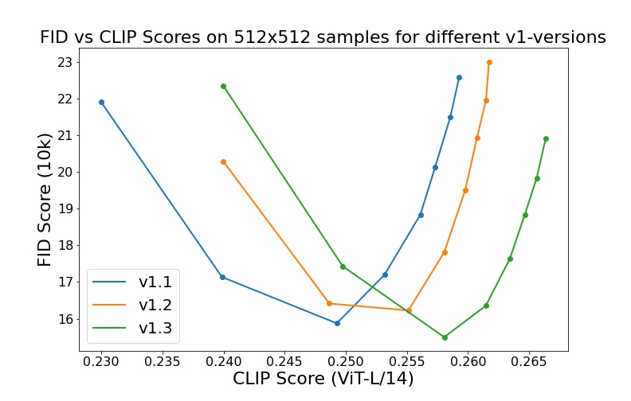
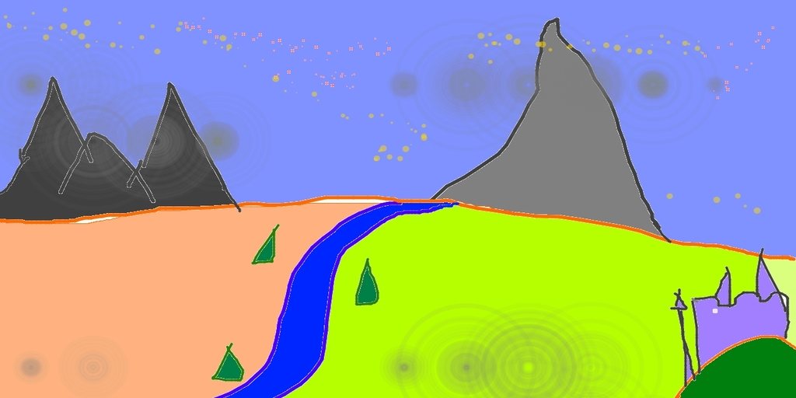

# Stable Diffusion
*Stable Diffusion was made possible thanks to a collaboration with [Stability AI](https://stability.ai/) and [Runway](https://runwayml.com/) and builds upon our previous work:*

[**High-Resolution Image Synthesis with Latent Diffusion Models**](https://arxiv.org/abs/2112.10752)<br/>
[Robin Rombach](https://github.com/rromb)\*,
[Andreas Blattmann](https://github.com/ablattmann)\*,
[Dominik Lorenz](https://github.com/qp-qp)\,
[Patrick Esser](https://github.com/pesser),
[Björn Ommer](https://hci.iwr.uni-heidelberg.de/Staff/bommer)<br/>

which is available on [GitHub](https://github.com/CompVis/latent-diffusion).


[Stable Diffusion](#stable-diffusion-v1) is a latent text-to-image diffusion
model.
Thanks to a generous compute donation from [Stability AI](https://stability.ai/) and support from [LAION](https://laion.ai/), we were able to train a Latent Diffusion Model on 512x512 images from a subset of the [LAION-5B](https://laion.ai/blog/laion-5b/) database. 
Similar to Google's [Imagen](https://arxiv.org/abs/2205.11487), 
this model uses a frozen CLIP ViT-L/14 text encoder to condition the model on text prompts.
With its 860M UNet and 123M text encoder, the model is relatively lightweight and runs on a GPU with at least 10GB VRAM.
See [this section](#stable-diffusion-v1) below and the [model card](https://huggingface.co/CompVis/stable-diffusion).

  
## Requirements
A suitable [conda](https://conda.io/) environment named `ldm` can be created
and activated with:

```
conda env create -f environment.yaml
conda activate ldm
```

You can also update an existing [latent diffusion](https://github.com/CompVis/latent-diffusion) environment by running

```
conda install pytorch torchvision -c pytorch
pip install transformers==4.19.2
pip install -e .
``` 


## Stable Diffusion v1

Stable Diffusion v1 refers to a specific configuration of the model
architecture that uses a downsampling-factor 8 autoencoder with an 860M UNet
and CLIP ViT-L/14 text encoder for the diffusion model. The model was pretrained on 256x256 images and 
then finetuned on 512x512 images.

*Note: Stable Diffusion v1 is a general text-to-image diffusion model and therefore mirrors biases and (mis-)conceptions that are present
in its training data. 
Details on the training procedure and data, as well as the intended use of the model can be found in the corresponding [model card](https://huggingface.co/CompVis/stable-diffusion).
Research into the safe deployment of general text-to-image models is an ongoing effort. To prevent misuse and harm, we currently provide access to the checkpoints only for [academic research purposes upon request](https://stability.ai/academia-access-form).
**This is an experiment in safe and community-driven publication of a capable and general text-to-image model. We are working on a public release with a more permissive license that also incorporates ethical considerations.***

[Request access to Stable Diffusion v1 checkpoints for academic research](https://stability.ai/academia-access-form) 

### Weights

We currently provide three checkpoints, `sd-v1-1.ckpt`, `sd-v1-2.ckpt` and `sd-v1-3.ckpt`,
which were trained as follows,

- `sd-v1-1.ckpt`: 237k steps at resolution `256x256` on [laion2B-en](https://huggingface.co/datasets/laion/laion2B-en).
  194k steps at resolution `512x512` on [laion-high-resolution](https://huggingface.co/datasets/laion/laion-high-resolution) (170M examples from LAION-5B with resolution `>= 1024x1024`).
- `sd-v1-2.ckpt`: Resumed from `sd-v1-1.ckpt`.
  515k steps at resolution `512x512` on "laion-improved-aesthetics" (a subset of laion2B-en,
filtered to images with an original size `>= 512x512`, estimated aesthetics score `> 5.0`, and an estimated watermark probability `< 0.5`. The watermark estimate is from the LAION-5B metadata, the aesthetics score is estimated using an [improved aesthetics estimator](https://github.com/christophschuhmann/improved-aesthetic-predictor)).
- `sd-v1-3.ckpt`: Resumed from `sd-v1-2.ckpt`. 195k steps at resolution `512x512` on "laion-improved-aesthetics" and 10\% dropping of the text-conditioning to improve [classifier-free guidance sampling](https://arxiv.org/abs/2207.12598).

Evaluations with different classifier-free guidance scales (1.5, 2.0, 3.0, 4.0,
5.0, 6.0, 7.0, 8.0) and 50 PLMS sampling
steps show the relative improvements of the checkpoints:



### Text-to-Image with Stable Diffusion


Stable Diffusion is a latent diffusion model conditioned on the (non-pooled) text embeddings of a CLIP ViT-L/14 text encoder.

After [obtaining the weights](#weights), link them
```
mkdir -p models/ldm/stable-diffusion-v1/
ln -s <path/to/model.ckpt> models/ldm/stable-diffusion-v1/model.ckpt 
```
and sample with
```
python scripts/txt2img.py --prompt "a photograph of an astronaut riding a horse" --plms 
```
By default, this uses a guidance scale of `--scale 7.5`, [Katherine Crowson's implementation](https://github.com/CompVis/latent-diffusion/pull/51) of the [PLMS](https://arxiv.org/abs/2202.09778) sampler, 
and renders images of size 512x512 (which it was trained on) in 50 steps. All supported arguments are listed below (type `python scripts/txt2img.py --help`).

```commandline
usage: txt2img.py [-h] [--prompt [PROMPT]] [--outdir [OUTDIR]] [--skip_grid] [--skip_save] [--ddim_steps DDIM_STEPS] [--plms] [--laion400m] [--fixed_code] [--ddim_eta DDIM_ETA] [--n_iter N_ITER] [--H H] [--W W] [--C C] [--f F] [--n_samples N_SAMPLES] [--n_rows N_ROWS]
                  [--scale SCALE] [--from-file FROM_FILE] [--config CONFIG] [--ckpt CKPT] [--seed SEED] [--precision {full,autocast}]

optional arguments:
  -h, --help            show this help message and exit
  --prompt [PROMPT]     the prompt to render
  --outdir [OUTDIR]     dir to write results to
  --skip_grid           do not save a grid, only individual samples. Helpful when evaluating lots of samples
  --skip_save           do not save individual samples. For speed measurements.
  --ddim_steps DDIM_STEPS
                        number of ddim sampling steps
  --plms                use plms sampling
  --laion400m           uses the LAION400M model
  --fixed_code          if enabled, uses the same starting code across samples
  --ddim_eta DDIM_ETA   ddim eta (eta=0.0 corresponds to deterministic sampling
  --n_iter N_ITER       sample this often
  --H H                 image height, in pixel space
  --W W                 image width, in pixel space
  --C C                 latent channels
  --f F                 downsampling factor
  --n_samples N_SAMPLES
                        how many samples to produce for each given prompt. A.k.a. batch size
  --n_rows N_ROWS       rows in the grid (default: n_samples)
  --scale SCALE         unconditional guidance scale: eps = eps(x, empty) + scale * (eps(x, cond) - eps(x, empty))
  --from-file FROM_FILE
                        if specified, load prompts from this file
  --config CONFIG       path to config which constructs model
  --ckpt CKPT           path to checkpoint of model
  --seed SEED           the seed (for reproducible sampling)
  --precision {full,autocast}
                        evaluate at this precision

<<<<<<< HEAD
=======
Therefore, you should changed the weight for the specific token index as below:
```
The code is located on the line249 and 257 in "./ldm/modules/attenion.py"

def forward(self, x, context=None, scontext=None, pmask=None, time=None, mask=None):
    """
    x.shape: (6,4096,320)
    context.shape(6,77,768)
    q, k, v shape: (6, hw, 320), (6, 77, 320), (6, 77, 320)
    -> q,k,v shape: (32, hw, 40=320/8=self.head), (32, 77, 40=320/8=self.head), (32, 77, 40=320/8=self.head)

    - visualization.
    1. aggregate all attention map across the "timesteps" and "heads"
    2. Normalization divided by "max" with respecto to "each token"
    """

    h = self.heads
    if scontext == "selfattn":
        sim, attn, v = self.get_attmap(x=x, h=self.heads, context=context, mask=None)
        sattn = None
    else:
        if scontext is None:
            sim, attn, v = self.get_attmap(x=x, h=self.heads, context=context, mask=None)
            sattn = None

            """ cross attention control: only reweighting is possible. """
            """ The swap and adding new phrase do not work because, the source prompt does not exist in this case. """
            """
            ex) A photo of a house on a snowy mountain
            : for controlling "snowy":
            the token index=8.
            the weights for sample1~3 are -2, 1, 5 in this example.
            """
            attn = self.cross_attention_control(tattmap=attn, t=time, token_idx=[2], weights=[[-2., 1., 5.]] )
        else:
            x, sx = x.chunk(2)
            sim, attn, v = self.get_attmap(x=x, h=self.heads, context=context, mask=None)
            ssim, sattn, sv = self.get_attmap(x=sx, h=self.heads, context=scontext, mask=None)

            """ cross attention control """
            bh, hw, tleng = attn.shape
            attn = self.cross_attention_control(tattmap=attn, sattmap=sattn, pmask=pmask, t=time, token_idx=[0], weights=[[1., 1., 1.]] )
>>>>>>> 1b102dbfe3f298493dceaa7b71b7514aafacad82
```
Note: The inference config for all v1 versions is designed to be used with EMA-only checkpoints. 
For this reason `use_ema=False` is set in the configuration, otherwise the code will try to switch from
non-EMA to EMA weights. If you want to examine the effect of EMA vs no EMA, we provide "full" checkpoints
which contain both types of weights. For these, `use_ema=False` will load and use the non-EMA weights.

<<<<<<< HEAD
=======
We can compare the results with different weight through this scripts:
(If you use "fixed_code", all the samples are generated with same fixed latent vectors. For better comparison, I recommend you to utilize this argument.)
```
# ./swap.sh
python ./scripts/swap.py\
    --prompt "A photo of a house on a snowy mountain"\
    --n_samples 3\
    --strength 0.99\
    --fixed_code\
    #--sprompt "photo of a cat riding on a bicycle"\
    #--is-swap\
    #--fixed_code\
    # --save_attn_dir "/root/media/data1/sdm/attenmaps_apples_swap_orig/"\
    # --is_get_attn\

chmod -R 777 ./
```
# Visualize Cross Attention Map
Please note that visualization code 
>>>>>>> 1b102dbfe3f298493dceaa7b71b7514aafacad82

### Image Modification with Stable Diffusion

By using a diffusion-denoising mechanism as first proposed by [SDEdit](https://arxiv.org/abs/2108.01073), the model can be used for different 
tasks such as text-guided image-to-image translation and upscaling. Similar to the txt2img sampling script, 
we provide a script to perform image modification with Stable Diffusion.  

The following describes an example where a rough sketch made in [Pinta](https://www.pinta-project.com/) is converted into a detailed artwork.
```
python scripts/img2img.py --prompt "A fantasy landscape, trending on artstation" --init-img <path-to-img.jpg> --strength 0.8
```
Here, strength is a value between 0.0 and 1.0, that controls the amount of noise that is added to the input image. 
Values that approach 1.0 allow for lots of variations but will also produce images that are not semantically consistent with the input. See the following example.

**Input**



**Outputs**


This procedure can, for example, also be used to upscale samples from the base model.


## Comments 

- Our codebase for the diffusion models builds heavily on [OpenAI's ADM codebase](https://github.com/openai/guided-diffusion)
and [https://github.com/lucidrains/denoising-diffusion-pytorch](https://github.com/lucidrains/denoising-diffusion-pytorch). 
Thanks for open-sourcing!

- The implementation of the transformer encoder is from [x-transformers](https://github.com/lucidrains/x-transformers) by [lucidrains](https://github.com/lucidrains?tab=repositories). 


## BibTeX

```
@misc{rombach2021highresolution,
      title={High-Resolution Image Synthesis with Latent Diffusion Models}, 
      author={Robin Rombach and Andreas Blattmann and Dominik Lorenz and Patrick Esser and Björn Ommer},
      year={2021},
      eprint={2112.10752},
      archivePrefix={arXiv},
      primaryClass={cs.CV}
}

```


